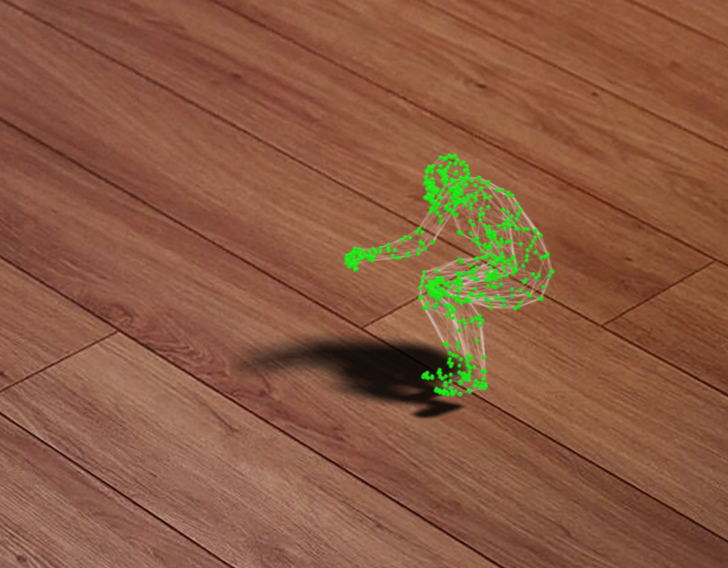
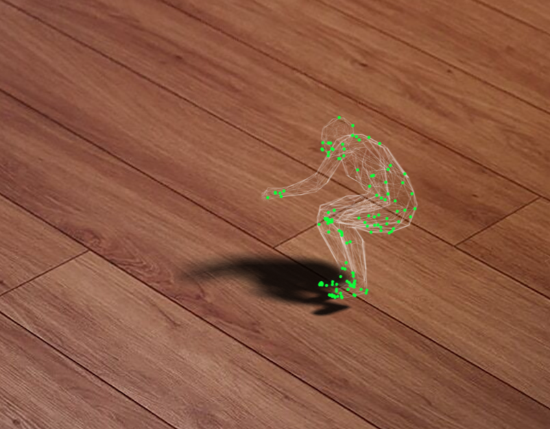
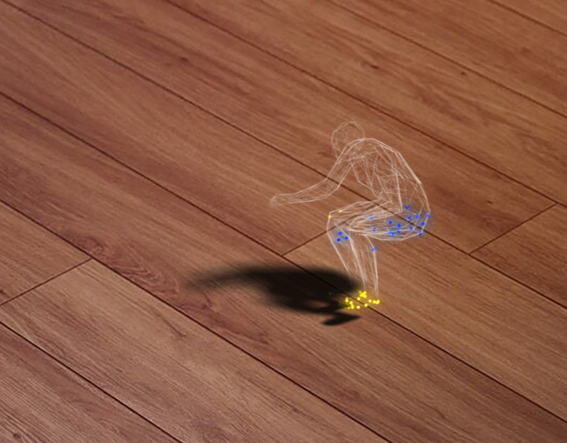

# Efficient Human-Contact Representation for Human-Scene Interaction

> Human-scene interaction is an active research topic with several industrial applications in virtual reality, gaming, robotics, and surveillance. Despite significant progress in network architectures to improve the results or optimize models' parameters for fast inference speed, the efficient representation of contact between humans and their environments remains an open challenge. In this paper, we propose a new efficient human-contact representation for human-scene interaction. Our primary contribution is the introduction of sparse contact masks that strategically select essential contact information, significantly reducing redundant data in high-dimensional inputs. Leveraging this efficient contact representation, we propose a suite of sparse operators to replace traditional dense operators within deep network layers for faster computation. Our approach not only enhances computational speed but also filters out non-essential contact data, thereby improving the precision of human-scene interaction models. To validate the effectiveness of our method, we conduct intensive experiments across three public benchmark datasets, focusing on two critical tasks for human-scene interaction: contact prediction and scene synthesis. The experimental results show that our approach outperforms state-of-the-art models in reconstruction accuracy and achieves a computation speed-up of at least 12 times over recent baselines.

<p float="center">
  
   
  
  
</p>

## Description

Implementation of our paper [Efficient Human-Contact Representation for Human-Scene Interaction](). 

## Table of Contents
  * [Description](#description)
  * [Table of Contents](#table-of-contents)
  * [Install dependencies](#install-dependencies)
  * [Dataset](#dataset)
  * [Contact Prediction Task](#contact-prediction-task)
  * [Acknowleagments](#acknowleagments)

## Install dependencies 

This implementation requires Python 3.8 and CUDA 11.6. You can install via. 
```
conda create eco python=3.8 
conda activate eco 
conda install pytorch torchvision torchaudio pytorch-cuda=11.6 -c pytorch -c nvidia
```

The Minkowski Engine package for sparse layers can be installed by following instruction in this [repo](https://github.com/NVIDIA/MinkowskiEngine/tree/master). 

The other dependencies can be installed by `pip` package: 
```
pip install -r requirements.txt
```

## Dataset

We provide the preprocessed dataset, including [PROXD](https://huggingface.co/datasets/aiozai/ECO/blob/main/data.zip). Please download and put it in the root folder.

For testing, you can use a small subset of 3D_Future dataset. Please download it using [this link](https://huggingface.co/datasets/aiozai/ECO/blob/main/3D_Future.zip) and put it in the root folder.

## Contact Prediction Task
To train the contact prediction task on PROXD Dataset, please run: 
```
bash train.sh
```

You can run a various setups of number of sparse masks and sparsity ratio by modifying the `--no_sparse_mask` and `--sparsity_ratio` flag respectively. 

The checkpoints will be saved under OUTPUT_DIR/EXPERIMENT folder.  

If you want to train the contact prediction task on BEHAVE Dataset, just change the `--train_data_dir` and `--valid_data_dir` to the location of BEHAVE Dataset.

To test a checkpoint on PROXD Dataset, please run: 

```
bash test.sh
```

You can modify the `--keep_mask` flag in `test_eco.py` to change the number of masks you want to keep. This value must be less than or equal to the number of masks used in checkpoint.

## Scene Synthesis

First, you need to save the contact prediction of your model to `.npy` file by enabling the `--save_result` flag in `ContactECO/test_eco.py`. 

You can follow the guide in **Scene Synthesis** section in this [repo](https://github.com/onestarYX/summon/tree/main?tab=readme-ov-file#scene-synthesis) for more details. We only add the code for non-collision metric calculation. 

To fit best object based on **the most probossible** contact prediction for motion sequence MPH11_00150_01 saved at
`data/proxd_valid/vertices/MPH11_00150_01_verts.npy` and contact predictions saved at
`predictions/proxd_valid/MPH11_00150_01.npy` you can run the following,
**under the root directory of this repository**:
```
python fit_best_obj.py --sequence_name MPH11_00150_01 --vertices_path data/proxd_valid/vertices/MPH11_00150_01_verts.npy --contact_labels_path predictions/proxd_valid/MPH11_00150_01.npy --output_dir fitting_results
```

If you want to visualize the fitting result (i.e. recovered objects along with the human motion),
using the same example as mentioned above, you can run
```
python vis_fitting_results.py --fitting_results_path fitting_results/MPH11_00150_01 --vertices_path data/proxd_valid/vertices/MPH11_00150_01_verts.npy
```

To check the non-collision metric between SMPL-X human body and generated scene for the example motion, you can run 

```
python metric.py --fitting_results_path fitting_results/MPH11_00150_01 --vertices_path data/proxd_valid/vertices/MPH11_00150_01_verts.npy
```

Some results of contactFormer checkpoints
```
MPH112_00169_01: 0.998 
MPH112_00151_01: 0.975
N3OpenArea_03301_01: 0.981
N3Office_00034_01: 0.993
MPH11_00150_01: 0.976
N0Sofa_00034_02: 0.971
```
## Acknowleagments 

We followed the implementation of [this repo](https://github.com/onestarYX/summon), including Scene Synthesis task and metrics. Thank the authors for sharing the code.


